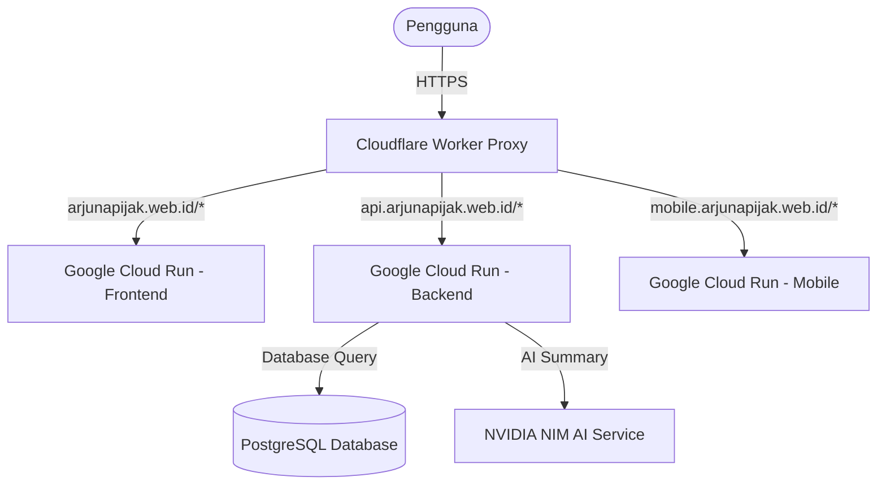

# 🏹 Arjuna Pijak (Archipelago Food Price Prediction)

[](https://fastapi.tiangolo.com/)
[](https://vuejs.org/)
[](https://flutter.dev/)
[](https://vitejs.dev/)
[](https://tailwindcss.com/)
[](https://www.docker.com/)
[](https://cloud.google.com/)
[](https://www.cloudflare.com/)

**Arjuna Pijak** adalah platform cerdas untuk memantau, menganalisis, dan memprediksi pergerakan harga komoditas pangan di berbagai daerah di Indonesia. Aplikasi ini mengintegrasikan pemodelan statistik tingkat lanjut dengan antarmuka yang modern, dinamis, dan responsif.

🔗 **Tautan Akses:**
- 🖥️ **Web Utama**: [https://arjunapijak.web.id](https://arjunapijak.web.id)
- 📱 **Mobile Web**: [https://mobile.arjunapijak.web.id](https://mobile.arjunapijak.web.id)

---

## ✨ Fitur Utama

- 📈 **Prediksi Harga Pangan**: Menggunakan model statistik runtun waktu (*Time Series Forecasting*) berbasis Python (Statsmodels/Pandas) untuk memberikan estimasi harga komoditas pangan di masa mendatang.
- 📑 **Ringkasan Pasar AI (Market Summary)**: Analisis berbasis AI untuk merangkum sentimen pasar, pergerakan harga signifikan, dan kondisi ketahanan pangan secara otomatis.
- 🔄 **Sinkronisasi Data Otomatis**: Layanan terjadwal menggunakan `APScheduler` untuk memperbarui data komoditas pangan secara *real-time* dari sumber data terpercaya.
- 📊 **Dashboard Interaktif**: Visualisasi grafik interaktif yang mudah dipahami oleh masyarakat luas maupun pengambil kebijakan.
- ⚡ **Performa Kilat**: Kombinasi *Vite + Vue 3* untuk rendering instan dan *Cloudflare Worker* untuk *caching* & routing pintar secara *serverless*.

---

## 🏗️ Arsitektur Sistem

Aplikasi dideploy secara *serverless* dengan arsitektur modern berbiaya rendah dan performa tinggi:



---

## 📁 Struktur Proyek

```
arjuna-app/
├── backend/            # REST API & Analisis Data (FastAPI + Statsmodels)
│   ├── app/            # Kode utama aplikasi backend
│   │   ├── api/        # Endpoint API
│   │   ├── services/   # Logika bisnis (forecasting, sync, AI summary)
│   │   └── db/         # Setup database & ORM
│   └── Dockerfile.prod # Konfigurasi containerisasi produksi
├── frontend/           # Aplikasi Client Web (Vue 3 + Vite + Tailwind CSS)
│   ├── src/            # Komponen, router, views, dan aset
│   └── Dockerfile.prod # Konfigurasi containerisasi produksi
├── mobile/             # Aplikasi Client Mobile (Flutter Web App)
│   ├── lib/            # Kode utama Flutter (Riverpod, BLoC/Cubit, UI)
│   └── Dockerfile.prod # Containerisasi multi-stage (Flutter SDK -> Nginx)
└── cloudflare-proxy/   # Serverless Reverse Proxy (Cloudflare Workers)
    └── src/index.js    # Logika routing & rewrite lalu lintas
```

---

## 🚀 Panduan Memulai Cepat (Lokal)

### Menggunakan Docker Compose (Direkomendasikan)

Pastikan Anda telah memasang [Docker](https://www.docker.com/) dan [Docker Compose](https://docs.docker.com/compose/) di komputer Anda.

1. Klon repositori ini:
   ```bash
   git clone https://github.com/Wildaafn/arjuna-app.git
   cd arjuna-app
   ```
2. Jalankan seluruh layanan (Backend, Frontend, dan Database):
   ```bash
   docker-compose up --build
   ```
3. Akses aplikasi di peramban Anda:
   - Frontend: `http://localhost:5173`
   - API Dokumentasi (Swagger UI): `http://localhost:8000/docs`

---

## 🛠️ Pengembangan Manual (Lokal)

### 1. Setup Backend (Python & FastAPI)

1. Masuk ke direktori backend:
   ```bash
   cd backend
   ```
2. Buat environment virtual dan pasang dependensi:
   ```bash
   python3 -m venv venv
   source venv/bin/activate
   pip install -r requirements.txt
   ```
3. Buat berkas `.env` berdasarkan berkas `.env.example` dan sesuaikan konfigurasinya.
4. Jalankan migrasi atau seeder awal:
   ```bash
   python seeder.py
   ```
5. Jalankan server backend:
   ```bash
   uvicorn app.main:app --reload --port 8000
   ```

### 2. Setup Frontend (Vue 3 & Vite)

1. Masuk ke direktori frontend:
   ```bash
   cd ../frontend
   ```
2. Pasang dependensi Node.js:
   ```bash
   npm install
   ```
3. Jalankan server dev:
   ```bash
   npm run dev
   ```

### 3. Setup Mobile (Flutter Web)

1. Pastikan Anda telah menginstal [Flutter SDK](https://docs.flutter.dev/get-started/install) versi stabil.
2. Masuk ke direktori mobile:
   ```bash
   cd ../mobile
   ```
3. Unduh package yang dibutuhkan:
   ```bash
   flutter pub get
   ```
4. Jalankan aplikasi pada mode web lokal:
   ```bash
   flutter run -d chrome
   ```

---

## ☁️ Integrasi & Deployment (CI/CD)

Proyek ini terintegrasi sepenuhnya dengan **Google Cloud Build** (`cloudbuild.yaml`) untuk melancarkan proses integrasi dan penyebaran berkelanjutan:
- **Build & Push**: Docker image untuk backend (FastAPI), frontend web (Vue 3), dan mobile web (Flutter) dibuat secara otomatis saat terjadi *push* ke cabang utama (`main`) dan diunggah ke *Artifact Registry* GCP.
- **Serverless Deploy**: Ketiga image disebarkan langsung ke *Google Cloud Run* (`arjuna-backend`, `arjuna-frontend`, `arjuna-mobile`) dengan penskalaan dinamis dari `0` hingga `3` instansi (untuk efisiensi biaya optimal di bawah anggaran $5).
- **Reverse Proxy & Routing**: Diarahkan via *Cloudflare Worker* (`cloudflare-proxy`) agar domain utama `arjunapijak.web.id`, API `api.arjunapijak.web.id`, dan mobile `mobile.arjunapijak.web.id` terpusat dan dilindungi oleh SSL Cloudflare.

---

## 📝 Kontributor & Lisensi

Dibuat oleh **Tim Arjuna Pijak Capstone (Rafly, Risky, wilda dan wildan)**. Seluruh kode dilisensikan di bawah lisensi MIT.


