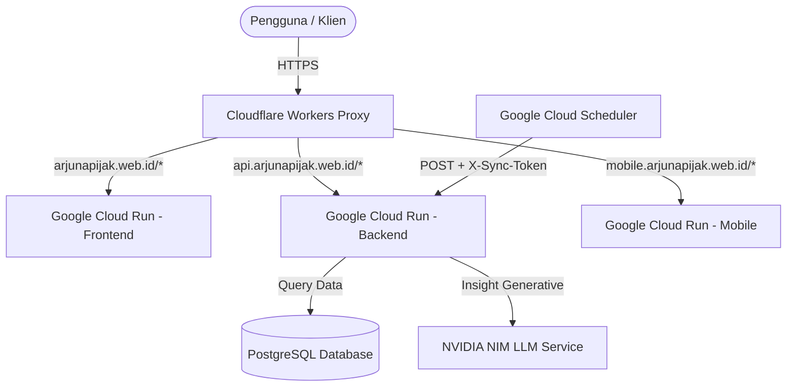

# 🏹 Arjuna Pijak (Archipelago Food Price Prediction)

[](https://fastapi.tiangolo.com/)
[](https://vuejs.org/)
[](https://flutter.dev/)
[](https://vitejs.dev/)
[](https://tailwindcss.com/)
[](https://www.docker.com/)
[](https://cloud.google.com/)
[](https://www.cloudflare.com/)

**Arjuna Pijak** adalah platform cerdas berbasis kecerdasan buatan (*Artificial Intelligence*) dan analisis prediktif yang dirancang untuk memantau, menganalisis, serta memprediksi pergerakan harga komoditas pangan strategis di berbagai wilayah Indonesia. Platform ini mengintegrasikan pemodelan statistik tingkat lanjut dengan antarmuka pengguna yang modern, dinamis, dan intuitif guna membantu pelaku UMKM, masyarakat umum, serta pengambil kebijakan dalam mengantisipasi gejolak harga pangan.

---

## 🔗 Tautan Akses Aplikasi

| Layanan | Domain Resmi | Platform Deployment |
| :--- | :--- | :--- |
| 🖥️ **Web Dashboard Utama** | [arjunapijak.web.id](https://arjunapijak.web.id) | Google Cloud Run (Frontend Vue 3) |
| 📱 **Mobile Web App** | [mobile.arjunapijak.web.id](https://mobile.arjunapijak.web.id) | Google Cloud Run (Flutter Web) |
| ⚙️ **API Gateway & Backend** | [api.arjunapijak.web.id](https://api.arjunapijak.web.id) | Google Cloud Run (FastAPI Python) |

---

## ✨ Fitur Utama Platform

* **📈 Time Series Forecasting (SARIMAX Tuned)**: Pemodelan runtun waktu otomatis yang menganalisis musiman dan tren harga pangan strategis (seperti beras, cabai, bawang, daging) untuk memberikan estimasi harga hingga 30 hari ke depan.
* **📑 AI Market Insight (NVIDIA NIM)**: Analisis wawasan cerdas bertenaga model bahasa besar (*Large Language Model*) dari NVIDIA NIM untuk merangkum pergerakan harga signifikan dan memberikan rekomendasi bisnis taktis bagi pelaku usaha dan masyarakat.
* **🛡️ Secure Sync & Auto-Retraining (Cloud Scheduler)**: Pipeline harian terjadwal (pukul 10:00 WIB) yang terproteksi token aman untuk menarik data terkini dari Bank Indonesia (BI), melatih ulang parameter model, serta memperbarui cache AI insight secara realtime.
* **📊 Visualisasi Trajektori & Audit Historis**: Grafik interaktif berskala tinggi untuk membandingkan data aktual dengan prediksi, serta melakukan audit performa akurasi model *in-sample fit*.
* **⚡ Serverless Performance**: Integrasi reverse proxy pintar menggunakan *Cloudflare Workers* untuk mempercepat routing global, optimalisasi aset, dan penanganan CORS.

---

## 🏗️ Arsitektur Sistem Terdistribusi

Sistem dideploy sepenuhnya di arsitektur cloud serverless berbiaya rendah dan performa tinggi:



---

## 📁 Struktur Repositori

```
arjuna-app/
├── backend/            # REST API & Analisis Data (FastAPI + Statsmodels)
│   ├── app/            # Source code utama backend Python
│   │   ├── api/        # Endpoint API & Proteksi Keamanan
│   │   ├── services/   # Logika bisnis (forecasting, sync, AI insight)
│   │   └── db/         # ORM & Schema Database (PostgreSQL)
│   └── Dockerfile.prod # Containerization produksi backend
├── frontend/           # Web Dashboard Utama (Vue 3 + Vite + Tailwind CSS)
│   ├── src/            # Komponen visual, router, views, dan services
│   └── Dockerfile.prod # Containerization produksi frontend
├── mobile/             # Aplikasi Mobile Web (Flutter Web App)
│   ├── lib/            # State management (Riverpod), UI views, & model
│   └── Dockerfile.prod # Multi-stage build (Flutter SDK -> Nginx)
└── cloudflare-proxy/   # Edge Reverse Proxy (Cloudflare Workers)
    └── src/index.js    # Logika routing subdomain dan rewrite URL
```

---

## 🚀 Panduan Menjalankan Aplikasi Secara Lokal

### Menggunakan Docker Compose (Sangat Direkomendasikan)

Pastikan Anda telah memasang [Docker](https://www.docker.com/) dan [Docker Compose](https://docs.google.com/compose/).

1. Klon repositori ini:
   ```bash
   git clone https://github.com/wildaafn/ArjunaAppPijak.git
   cd ArjunaAppPijak
   ```
2. Jalankan seluruh layanan beserta database PostgreSQL lokal:
   ```bash
   docker-compose up --build
   ```
3. Buka browser Anda dan akses:
   * **Frontend Web**: `http://localhost:5173`
   * **API Swagger Docs**: `http://localhost:8000/docs`

---

## ☁️ Continuous Integration & Deployment (CI/CD)

Seluruh pembaruan kode dideploy otomatis menggunakan **Google Cloud Build** (`cloudbuild.yaml`):
* **Build & Push**: Setiap *push* ke branch `main` memicu pembuatan Docker Image untuk backend, frontend, dan mobile secara paralel dan menyimpannya di *Artifact Registry*.
* **Serverless Deployment**: Cloud Build mendeploy container terbaru ke *Google Cloud Run* dengan auto-scaling (`0` - `3` instansi) guna menjamin efisiensi biaya.
* **Auto-Migration**: Database PostgreSQL diperbarui secara otomatis menggunakan SQLAlchemy ORM pada setiap siklus startup container.

---

## 👥 Kontributor & Lisensi

Dibuat dengan dedikasi oleh **Tim Arjuna Pijak Capstone**:
* 🧑‍💻 **Rafly**
* 🧑‍💻 **Risky**
* 🧑‍💻 **Wilda**
* 🧑‍💻 **Wildan**

Seluruh kode dalam proyek ini berlisensi di bawah [MIT License](LICENSE).
